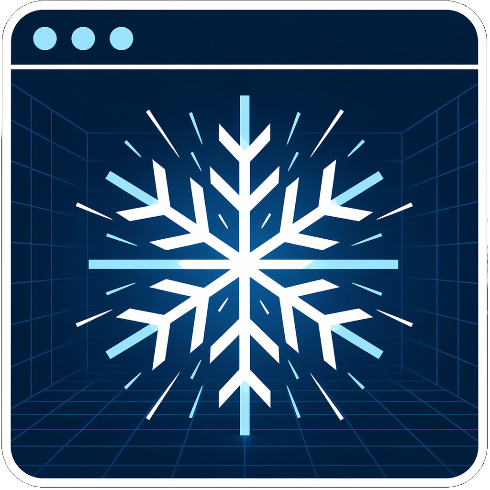
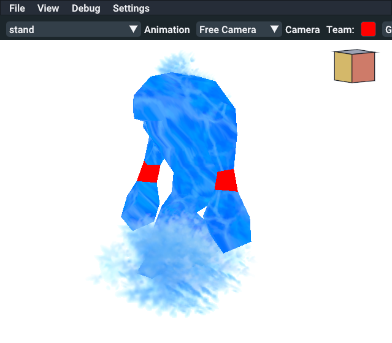

<p align="center">
  
</p>

<h1 align="center">WhiteoutFlakes</h1>

<p align="center">
  A rendering library for Warcraft III assets — classic and Reforged.
</p>

---

WhiteoutFlakes is a modular real-time renderer that reads native Warcraft III
model and texture data (`.mdx` / `.mdl`, `.blp`, `.dds`, animated sequences,
particle emitters, ribbons, splats, attachments, camera presets, day/night
cycle, …) and draws it through whichever graphics backend the platform
supports. The same library powers a standalone viewer, a 3ds Max preview
plugin, and any host that links against `WhiteoutFlakesLib`.

## Screenshots

<p align="center">
  
</p>

<details>
<summary><b>More screenshots</b></summary>

<table>
  <tr>
    <td></td>
    <td></td>
  </tr>
  <tr>
    <td></td>
    <td></td>
  </tr>
  <tr>
    <td></td>
  </tr>
</table>

</details>

## What it renders

- **MDX / MDL models** — classic (v800) and Reforged HD (v900, v1000, v1100, v1200),
  including multiple texture slots, fresnel terms, emissive gain, layer
  flipbooks, and per-vertex tangent frames.
- **Skeletal animation** — Hermite / Bezier / Linear tracks, global
  sequences, bone constraints, IK-free; multiple actors with independent
  timelines.
- **Particle emitters** — PartcileEmitter1, ParticleEmitter2, CornEffects
  Reforged effects via an interpolarity layer called cornflakes
  simulation runtime; ribbons, splats, projected decals, billboards.
- **Replaceable textures** — team color, team glow, tilesets (16 regions),
  cliff sets, water; the live-reload material path the Max plugin exposes
  re-skins models without restart.
- **Day / night cycle + IBL** — Portrait / Day-Night / Dungeon / Sunset
  probe sets, shadow cascades (0–3), tonemap, three lighting modes
  (InGame / Glue / Dynamic).
- **Camera presets** — scripted MDX cameras with optional animators, plus a
  ViewCube widget for free-orbit navigation.

## Graphics backends

| Backend | Platform | Notes |
| --- | --- | --- |
| D3D12  | Windows | Default on Windows. |
| D3D11  | Windows | Fallback for older drivers. |
| Vulkan | Windows / Linux / macOS | macOS goes through MoltenVK (Metal). |

The renderer abstracts every backend behind a unified `gfx::IGFXDevice`
interface; the engine itself never sees an `HWND` / `VkDevice` / `ID3D12*`.
Shaders are compiled once from Slang sources into BLS bundles that target
DXBC / DXIL / SPIR-V in parallel; the prebuilt pack ships under
[`prebuilt/shaders/`](prebuilt/shaders) so a fresh clone can render without
installing the Slang toolchain.

## Hosts

- **[`tools/basic_viewer/`](tools/basic_viewer/) `WhiteoutFlakes` standalone** — GLFW window + Dear ImGui UI, file picker via
  `nativefiledialog-extended`, cubeb-backed audio with 3D sound. Cross-platform.
- **[`tools/max_plugin/`](tools/max_plugin/) `WhiteoutFlakes.dlx` 3ds Max plugin** — Win32 host with the same Dear
  ImGui surface; lives next to the modeler, hot-reloads materials.

## Building

### Quick start (Windows / MSVC)

```
cmake -S . -B build -G "Visual Studio 17 2022" -A x64
cmake --build build --config Release --target WhiteoutFlakesStandalone
```

The standalone viewer lands at `build/standalone/Release/WhiteoutFlakes.exe`.

### Other toolchains

| Toolchain | Tested |
| --- | --- |
| MSVC 2022 | ✓ (primary) |
| Clang 21 (LLVM) + Ninja | ✓ |
| MinGW UCRT64 + Ninja | ✓ |
| GCC 15 (Linux) + Ninja | ✓ via CI |
| AppleClang 15 (macOS 13.3+) | ✓ via CI |

### Useful CMake options

| Option | Default | Purpose |
| --- | --- | --- |
| `WDX_BUILD_WC3_SHADERS`        | `OFF` | Run slangc and rebuild the BLS bundles from `externals/Wc3Shaders/`. |
| `WDX_USE_PREBUILT_SHADERS`     | auto  | Use the committed `prebuilt/shaders/` pack (auto-enabled when the dir exists and shaders aren't being built from source). |
| `WDX_BUILD_WC3_DEBUG_SHADERS`  | `ON`  | Also stage debug-symbol BLS bundles for the renderer's graphics-debug mode. |
| `WDX_ENABLE_TRACY`             | `ON`  | Link Tracy profiler client (`TRACY_ENABLE`, `TRACY_ON_DEMAND`). |
| `WDX_ENABLE_IMGUI`             | `ON`  | Engine-side BLS-backed Dear ImGui adapter + GLFW/Win32 frontends. |
| `WDX_BUILD_MAX_PLUGIN`         | `OFF` | Build the 3ds Max plugin (Windows only; needs `-DMAX_VERSION=<year>`). |

## Packaging

Prebuilt artifacts are produced by [GitHub Actions](.github/workflows/):

- **`linux-appimage.yml`** — Ubuntu 24.04 + GCC 15 + LunarG SDK 1.4.341.0;
  output: `WhiteoutFlakes-linux-x86_64.AppImage`.
- **`macos-dmg.yml`** — macOS 14 (Apple Silicon) + AppleClang + LunarG SDK
  1.4.341.0 (with MoltenVK); output: `WhiteoutFlakes-macos-arm64.dmg`,
  drag-and-drop installer with the .app, ad-hoc signed.

## Project layout

```
src/
  gfx/          Backend-agnostic graphics interface; D3D11 / D3D12 / Vulkan implementations.
  renderer/    Engine: pipeline, scene, BLS shader cache, particle system,
                shadow + IBL services, cornflakes (Reforged effects runtime).
  io/           MDX parsing adapter, BLP/DDS/TGA loaders, CASC/MPQ provider.
  public_api/   Stable C++ ABI used by external hosts (ActorView, etc.).

tools/
  basic_viewer/ Standalone GLFW + ImGui viewer.
  max_plugin/   3ds Max .dlx plugin.
  common/       Shared host utilities (cubeb sound emitter, ImGui theme).

externals/      Submodules: WhiteoutLib (MDX/CASC/MPQ), Wc3Shaders, GLFW,
                Dear ImGui, cubeb, Tracy, nativefiledialog-extended.

prebuilt/       Pre-compiled BLS shader pack + warmed-up PSO trace, so
                CI / fresh clones don't need the Slang toolchain.

packaging/      Linux .desktop + macOS Info.plist template.
```

## Status

Active development. The renderer is feature-complete for classic and
Reforged MDX content.

## License

See [`LICENSE`](LICENSE) for project terms and
[`LICENSE-AI.md`](LICENSE-AI.md) for the AI-tooling disclosure.
WhiteoutFlakes bundles a number of third-party libraries under their own
licenses; consult each submodule under [`externals/`](externals/) for
details.

> *Warcraft III is a trademark of Blizzard Entertainment, Inc.
> WhiteoutFlakes is an independent project not affiliated with or endorsed
> by Blizzard. The renderer reads only assets the user already owns.*
