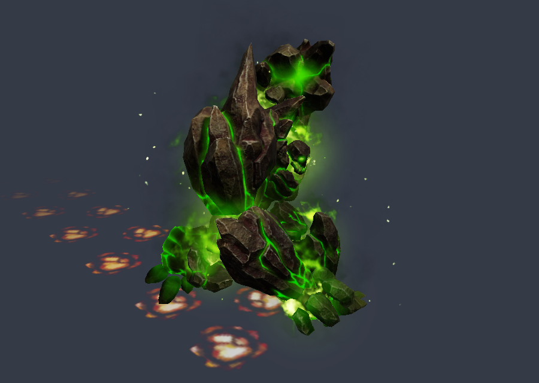
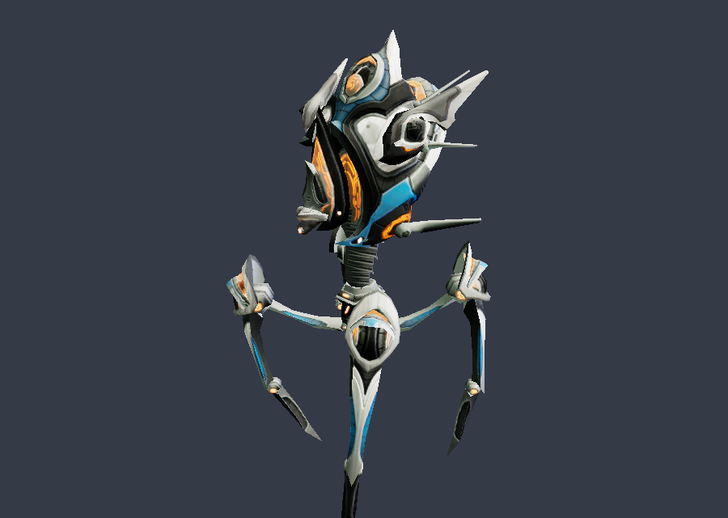
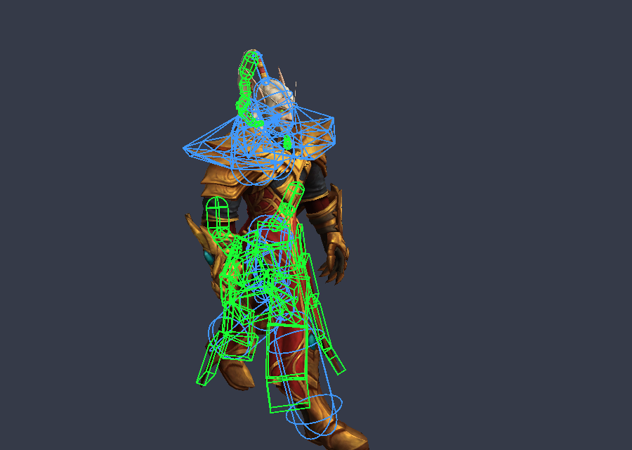
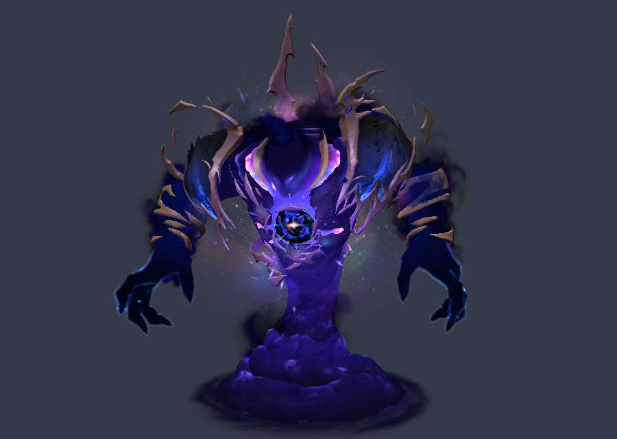
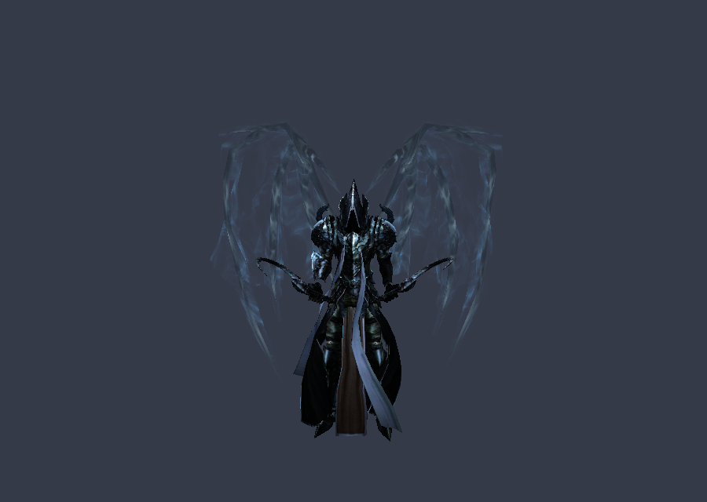
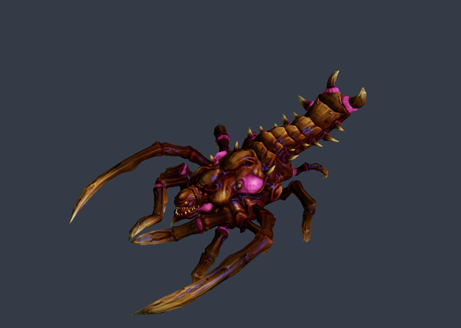
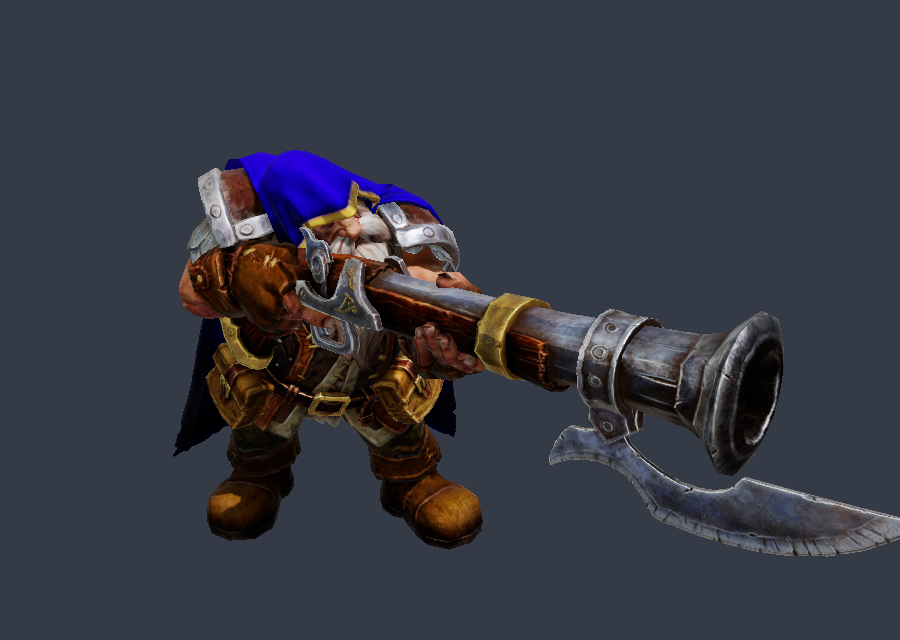
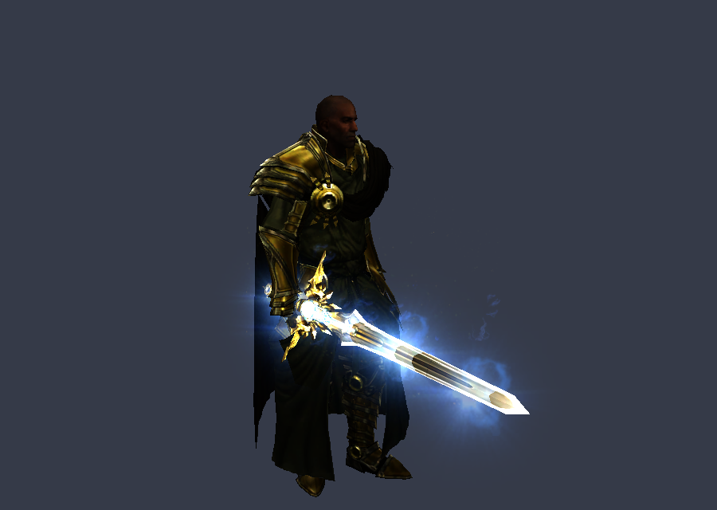
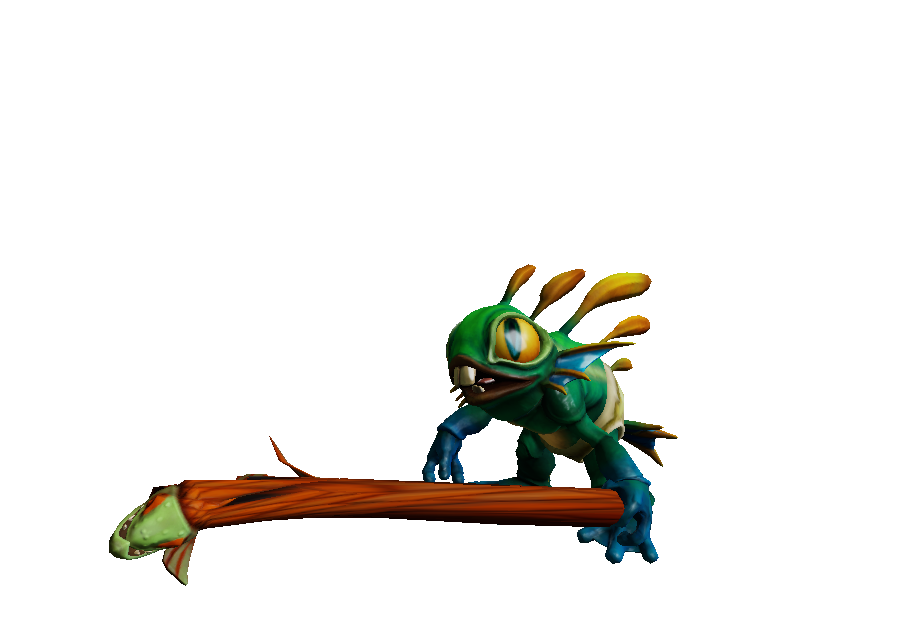

<p align="center">
  
</p>

<h1 align="center">WhiteoutFlakes</h1>

<p align="center">
  A rendering library for Blizzard game assets — Warcraft III, World of
  Warcraft, StarCraft II, Heroes of the Storm and Diablo III.
</p>

---

WhiteoutFlakes is a modular real-time renderer that reads native model, texture
and archive data and draws it through whichever graphics backend the platform
supports. Each game gets a **render profile** (pass order, target set, colour
space, world scale) and a **shading model**; each file format gets an
**adapter**. A game is a new profile rather than a branch through an existing
one. The same library powers a standalone viewer, a storage explorer, a 3ds Max
preview plugin, and any host that links `WhiteoutFlakesLib`.

## Screenshots

<p align="center">
  
</p>

<details>
<summary><b>More screenshots</b></summary>

<table>
  <tr>
    <td></td>
    <td></td>
  </tr>
  <tr>
    <td></td>
    <td></td>
  </tr>
  <tr>
    <td></td>
    <td></td>
  </tr>
  <tr>
    <td></td>
    <td></td>
  </tr>
</table>

</details>

## Games

| Game | Formats | Profile | Storage |
| --- | --- | --- | --- |
| Warcraft III — classic + Reforged | `.mdx` / `.mdl`, `.blp` | `wc3` | CASC + MPQ |
| World of Warcraft | `.m2` + `.skin`, `.phys`, `.blp` | `wow` | CASC + MPQ |
| StarCraft II | `.m3` + `.m3a`, `.dds` | `sc2_heroes` | CASC |
| Heroes of the Storm | `.m3` + `.m3a`, `.dds` | `sc2_heroes` | CASC |
| Diablo III | `.acr` / `.app`, `.tex` | `diablo3` | CASC |

Installs are located automatically per game; the viewer's settings panel can
point each one somewhere else or ignore CASC entirely.

### Current Support

| Game | Materials | Animations | Physics | Effects |
| --- | --- | --- | --- | --- |
| Warcraft III — classic + Reforged | Complete | Complete | N/A | Complete |
| World of Warcraft | Complete | Complete | Complete | Projections missing |
| StarCraft II | WIP | WIP | Complete | MISSING |
| Heroes of the Storm | WIP | WIP | Complete | MISSING |
| Diablo III | WIP | Complete | Complete | WIP |

### Planned Support

| Game |
| --- |
| Diablo IV |
| Diablo II Resurrected |
| Overwatch |

## Graphics backends

| Backend | Platform | Notes |
| --- | --- | --- |
| D3D12   | Windows | Default on Windows. |
| D3D11   | Windows | Fallback for older drivers. |
| Vulkan  | Windows / Linux / macOS | macOS via MoltenVK; primary backend on Linux. |
| Metal   | macOS   | Native backend — default on macOS. |
| WebGPU  | Browser | Emscripten + emdawnwebgpu; powers the web viewer. |

Every backend sits behind a unified `gfx::IGFXDevice`; the engine never sees an
`HWND` / `VkDevice` / `ID3D12*` / `MTLDevice` / `WGPUDevice`. Shaders compile
once from Slang sources into BLS bundles targeting DXBC / DXIL / SPIR-V / MSL /
WGSL in parallel; the prebuilt pack ships under
[`prebuilt/shaders/`](prebuilt/shaders) so a fresh clone renders without the
Slang toolchain.

## Hosts

- **[`tools/basic_viewer/`](tools/basic_viewer/) — `WhiteoutFlakes`** standalone
  GLFW + Dear ImGui viewer with a per-game settings panel, file picker, and
  cubeb-backed 3D audio. Cross-platform.
- **[`tools/model_explorer/`](tools/model_explorer/) — `WhiteoutFlakesExplorer`**
  CASC/MPQ storage browser with live per-cell model thumbnails.
- **[`tools/max_plugin/`](tools/max_plugin/) — `WhiteoutFlakes.dlx`** 3ds Max
  plugin: the same ImGui surface next to the modeler, hot-reloads materials.
- **[`tools/web_viewer/`](tools/web_viewer/)** Emscripten / WebGPU build
  (`wf-core.{js,wasm}`) driven by an ES module facade mirroring mdx-m3-viewer's
  shape. Assets stream from a picked local directory and/or Hiveworkshop's CASC
  mirror; [`casc_server/`](tools/web_viewer/casc_server/) is a Crow-based dev
  server for offline iteration.

## Building

### Quick start (Windows / MSVC)

```
cmake -S . -B build -G "Visual Studio 17 2022" -A x64
cmake --build build --config Release --target WhiteoutFlakesStandalone
```

The viewer lands at `build/standalone/Release/WhiteoutFlakes.exe`.

### Web viewer (Emscripten / WebGPU)

```
emcmake cmake -S . -B build-web -G Ninja
cmake --build build-web --target wf_web
python tools/web_viewer/serve_nocache.py 8080   # then open http://localhost:8080
```

### Other toolchains

| Toolchain | Tested |
| --- | --- |
| MSVC 2022 | ✓ (primary) |
| Clang 21 (LLVM) + Ninja | ✓ |
| MinGW UCRT64 + Ninja | ✓ |
| GCC 15 (Linux) + Ninja | ✓ via CI |
| AppleClang 15 (macOS 13.3+) | ✓ first-class — Metal backend, native arm64, signed `.dmg` |
| Emscripten 4.0.10+ + emdawnwebgpu | ✓ web viewer build (`-DEMSCRIPTEN=ON`) |

### Useful CMake options

| Option | Default | Purpose |
| --- | --- | --- |
| `WDX_ENABLE_M2`                | `ON`  | World of Warcraft `.m2` support. |
| `WDX_ENABLE_M3`                | `ON`  | StarCraft II / Heroes `.m3` support. |
| `WDX_ENABLE_D3`                | `ON`  | Diablo III actor support. |
| `WDX_ENABLE_PHYSICS`           | `ON`  | Snowball rigid-body and cloth simulation (needs M2 or M3). |
| `WDX_BUILD_WC3_SHADERS`        | `OFF` | Run slangc and rebuild the BLS bundles from `externals/Wc3Shaders/`. |
| `WDX_USE_PREBUILT_SHADERS`     | auto  | Use the committed `prebuilt/shaders/` pack. |
| `WDX_ENABLE_TRACY`             | `ON`  | Link the Tracy profiler client. |
| `WDX_ENABLE_IMGUI`             | `ON`  | Engine-side BLS-backed Dear ImGui adapter + GLFW/Win32 frontends. |
| `WDX_BUILD_MAX_PLUGIN`         | `OFF` | Build the 3ds Max plugin (Windows; needs `-DMAX_VERSION=<year>`). |
| `WDX_BUILD_CASC_SERVER`        | `OFF` | Build `wf_casc_server` — local dev replacement for Hive's CASC delivery. |
| `WDX_BUILD_TESTS`              | `OFF` | Build the Catch2 unit tests under `tests/`. |

Warcraft III rendering is unaffected by the other games' toggles; configure with
`-DWDX_ENABLE_M2=OFF -DWDX_ENABLE_M3=OFF -DWDX_ENABLE_D3=OFF` for a WC3-only
build.

## Tests

The `tests/` suite covers the headless engine — format adapters and skinning for
every game, animation math and blending, the particle and ribbon simulations,
surface classification, storage rules, path and texture-format policy. No GPU,
window or game archive is needed:

```
cmake -S . -B build -DWDX_BUILD_TESTS=ON
cmake --build build --config Release --target wdx_tests --parallel
ctest --test-dir build --build-config Release --output-on-failure
```

`cmake --build build --target check` does the last two in one go. Each
`TEST_CASE` registers as its own CTest test, so `ctest -R <name>` filters. The
AppVeyor Windows job runs the suite on every build.

## Packaging

Prebuilt artifacts come from [GitHub Actions](.github/workflows/):
`linux-appimage.yml` produces `WhiteoutFlakes-linux-x86_64.AppImage` (Ubuntu
24.04, GCC 15, LunarG SDK), and `macos-dmg.yml` produces
`WhiteoutFlakes-macos-arm64.dmg` (macOS 14 on Apple Silicon, native Metal with
Vulkan-via-MoltenVK also linked for backend comparison, ad-hoc signed).

## Project layout

```
src/
  gfx/          Backend-agnostic graphics interface; D3D11 / D3D12 /
                Vulkan / Metal / WebGPU implementations.
  io/           Format adapters — mdx, m2/, m3/, d3/ — plus image loaders,
                WoW client-DB tables (wow/) and CASC/MPQ storage (storage/).
  renderer/     Engine: pipeline, scene, BLS shader cache, particles,
                ribbons, shadow / IBL / GTAO / DoF services, cornflakes
                (Reforged effects), physics/snowball (Domino re-impl).
    profiles/   One directory per game: wc3/, wow/, sc2_heroes/, diablo3/.
  public_api/   Stable C++ ABI used by external hosts (ActorView, etc.).

tools/          Hosts — basic_viewer/, model_explorer/, max_plugin/,
                web_viewer/, and common/ host utilities.
tests/          Catch2 unit tests for the headless engine.
externals/      Submodules: WhiteoutLib (formats, CASC/MPQ, client DBs),
                Wc3Shaders, GLFW, Dear ImGui, cubeb, Tracy,
                nativefiledialog-extended.
prebuilt/       Pre-compiled BLS shader pack + warmed-up PSO trace.
packaging/      Linux .desktop + macOS Info.plist template.
```

## Status

Active development. Warcraft III is feature-complete for classic and Reforged
content; the other four games render textured, animated and simulated content
and are still gaining coverage.

## License

See [`LICENSE`](LICENSE) for project terms and
[`LICENSE-AI.md`](LICENSE-AI.md) for the AI-tooling disclosure.
WhiteoutFlakes bundles third-party libraries under their own licenses; consult
each submodule under [`externals/`](externals/).

> *Warcraft III, World of Warcraft, StarCraft II, Heroes of the Storm and
> Diablo III are trademarks of Blizzard Entertainment, Inc. WhiteoutFlakes is
> an independent project not affiliated with or endorsed by Blizzard. The
> renderer reads only assets the user already owns.*
